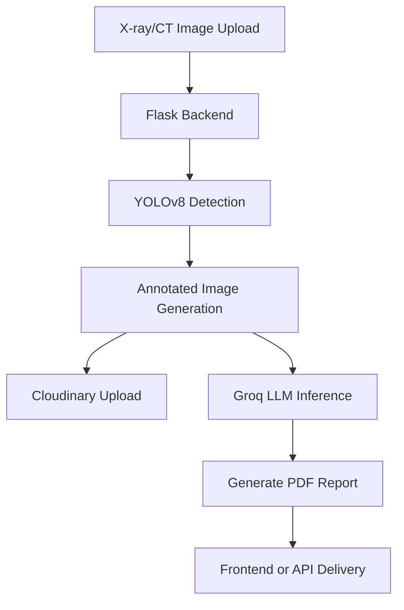

# Radiographic X-Ray Bone Fracture Severity Detection and Analysis

A comprehensive Python-based medical AI application for detecting bone fractures from radiographic X-ray images. This system supports real-time image analysis, annotated predictions, cloud storage, and dynamic PDF report generation — making it a powerful assistant for radiologists and orthopedic experts.

> 🚀 **Live Demo** coming soon on [GauravPatil.me](https://gauravpatil.me)  
> 🧠 Powered by YOLOv8 and integrated with Groq LLM for fracture severity interpretation.

---

## 📑 Table of Contents

- [Features](#features)
- [Architecture Overview](#architecture-overview)
- [Project Structure](#project-structure)
- [Installation](#installation)
- [Usage](#usage)
- [Requirements](#requirements)
- [Contributing](#contributing)
- [License](#license)

---

## ✅ Features

- ✅ **YOLOv8-powered** fracture detection on X-ray images  
- ✅ **In-memory image handling** using `BytesIO` (no disk dependency for inference)  
- ✅ **Annotated image generation** with bounding boxes and class labels  
- ✅ **PDF report generation** with embedded images and diagnostic summary  
- ✅ **Groq + Qwen 2.5 LLM** integration for medical recommendations  
- ✅ **Cloudinary support** for secure cloud-based image storage  
- ✅ **Modular Flask backend**, ready for deployment on platforms like Render or Vercel  
- ✅ **Responsive frontend integration** compatible with React/Angular

---

## 🧱 Architecture Overview



---

## 📁 Project Structure

```
Bone_Fracture_Detection/
│
├── annotated_images/              # Stores annotated X-ray images
├── app/                           # Flask app logic (YOLO, Cloudinary, PDF)
├── mnt/data/                      # Optional local data volume
├── uploads/                       # Input images for inference
├── requirements.txt               # Project dependencies
├── run.py                         # Main app launcher
├── temp_report.pdf                # Sample generated report
├── test_cloudinary_integration.py# Test for cloud upload flow
├── test_pdf_generation.py         # Test for PDF generation
└── .gitignore                     # Ignore rules for Git
```

---

## ⚙️ Installation

1. **Clone the repository:**

```bash
git clone https://github.com/Gatt101/Bone_Fracture_Detection.git
cd Bone_Fracture_Detection
```

2. **Install dependencies:**

```bash
pip install -r requirements.txt
```

---

## 🚀 Usage

### Run the application

```bash
python run.py
```

- Launches the backend Flask server
- Expects uploads in the `/uploads/` directory
- Annotated images are saved to `/annotated_images/`
- Generates PDF reports (`temp_report.pdf`)

### Run standalone tests

```bash
python test_cloudinary_integration.py
python test_pdf_generation.py
```

---

## 📦 Requirements

- Python 3.8+
- Required packages listed in `requirements.txt`

Key dependencies:

- `flask`
- `opencv-python`
- `ultralytics`
- `reportlab`
- `cloudinary`
- `requests`
- `Pillow`
- `python-dotenv`

---

## 🤝 Contributing

Contributions are welcome!  
Fork the repository, create a feature branch, and open a pull request with your proposed changes.

---

## 📄 License

This project is open source and available under the [MIT License](LICENSE).

---

## 📚 References

- [Bone Fracture Detection with YOLOv8](https://github.com/87tana/Bone-Fracture-Detection-Model-with-YOLOv8)
- [Cloudinary Python SDK](https://cloudinary.com/documentation/python_integration)
- [Groq API](https://console.groq.com/docs)
- [Ultralytics YOLOv8](https://docs.ultralytics.com)

---

<div align="center">⋆⋆⋆</div>
